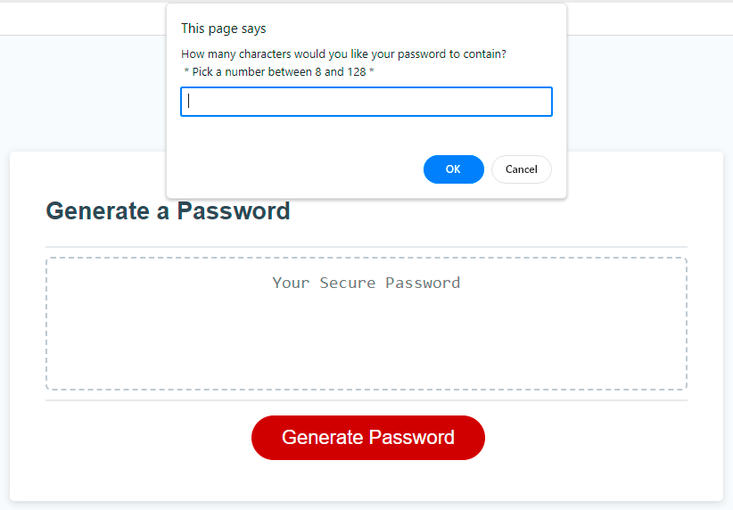
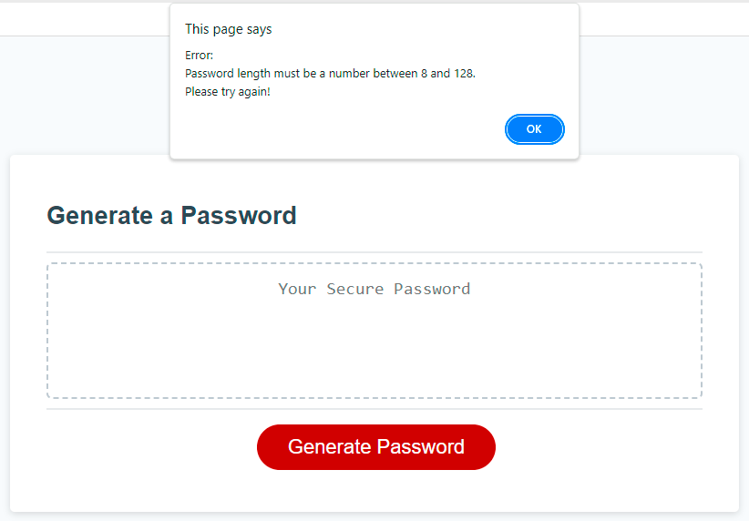
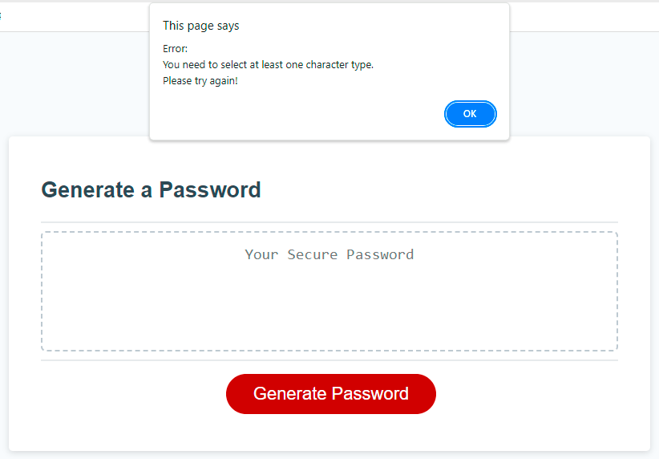
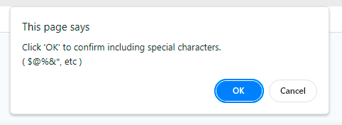
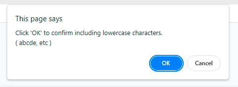
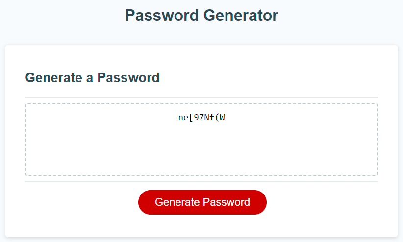
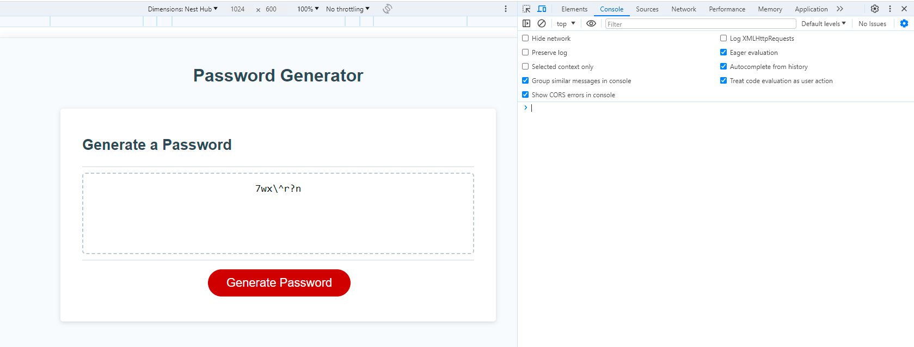

# Password-Generator-JavaScript
Module 5 Challenge: Password Generator

## Description 

This Console-Finances was created for bootcamp students who were taking the fifth week's challenge. In this challenge, my task was to create an application where users can generate random passwords based on the criteria they’ve selected.

The password generator application must meet the following critical requirements:
* Generate a password when the button is clicked
  * Present a series of prompts for password criteria
    * Length of password: 8 to 128 characters
    * Character types: Lowercase, Uppercase, Numeric, Special characters ($@%&*, etc)
  * Validate each input; ensure at least one character type is selected
  * After answering prompts, display the generated password in an alert or on the page.
* Ensure the application is error-free in Chrome DevTools inspection.

## Installation

N/A

## Usage 

To use Password-Generator-JavaScript,  you can review each file. 
To check whether the application meets critical requirements, open the webpage [Password Generator](https://qingh2o.github.io/Password-Generator-JavaScript/). 

Once the Password-Generator-JavaScrip web page loads, the application should look similar to the screenshot below.

### User flow with images

* Prompt user for password length.

* Alert with an error message if the entered number is out of range, not a number, or not entered by the user.

* Alert with an error message reminds the user need to choose at least one character type.

* When the password length meets the criteria, let the user confirm whether to include a special character type.

* Let the user confirm whether to include a numeric character type.

* Let the user confirm whether to include a lowercase character type.

* Let the user confirm whether to include a uppercase character type.

* Alert with an error message when the password length meets the criteria, but the user doesn't select any character type.

* Display the generated password on the page when user selects at least one character type.

### Inspect page using Chrome DevTools

Open Chrome DevTools by right-clicking the page and selecting "Inspect". An Elements panel should open either below or to the side of the webpage in the browser. Click on the Console to see if there are any errors.

The "Inspect" page should look similar to the screenshot below.

## Credits

N/A

## License

Please refer to the LICENSE in the repo.
